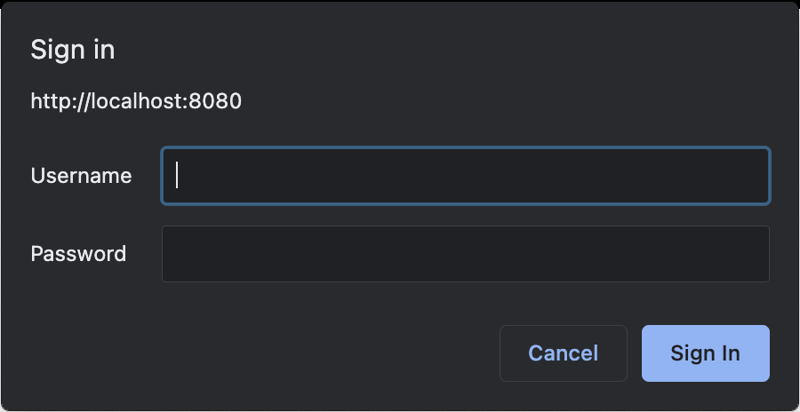

# openapi-ktor-sample


This project is a basic demo of the capabilities of the 
[openapi-ktor](https://github.com/sultanofcardio/openapi-ktor) project.

You will need at least JDK 8 to run it. Execute the sample
by running 
```shell
./gradlew run
```

or

```shell
gradlew.bat run
```

Then go to http://localhost:8080/docs to view the generated
swagger UI.

You will be prompted for credentials upon first load



You can leave it empty